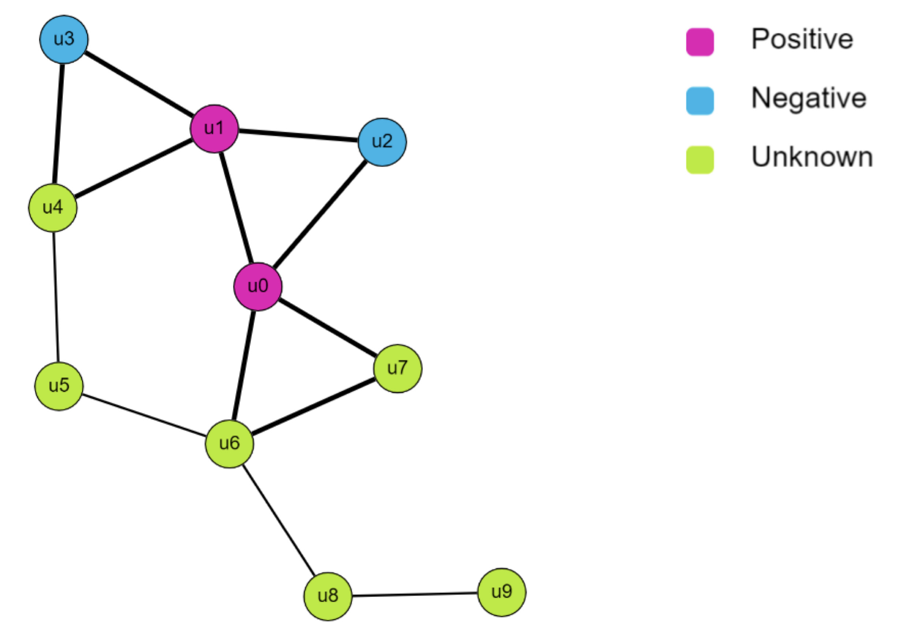
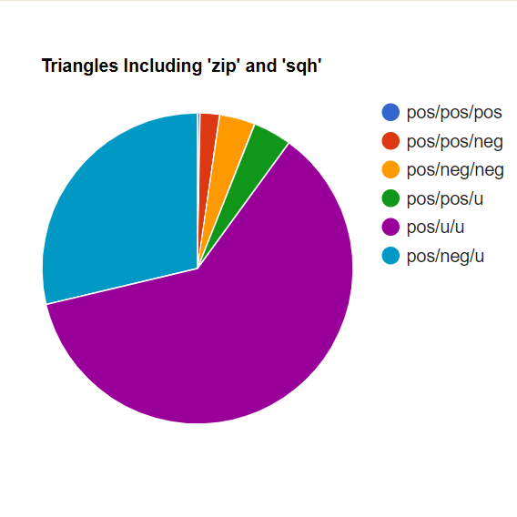
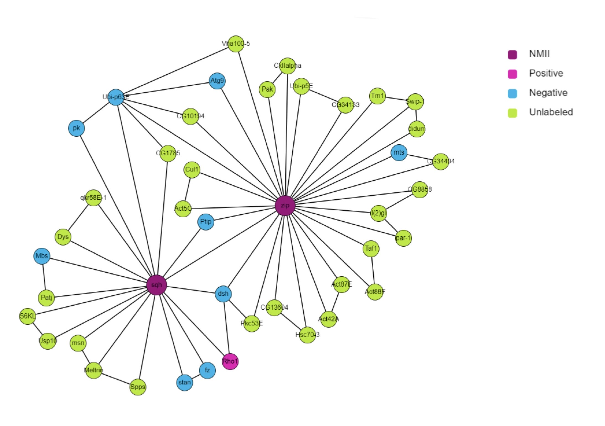

# Identifying Triangles in Drosophila Interactome

**Note for Anna:** This repository is complete but still private at the time that I am turning this in because I'd like to add more to it before making it public. When I make it public I will let you know!

# Abstract

There are several ways to visualize the interactions of proteins. One of them is to create a graph where each node is a protein and an edge between nodes symbolizes an interaction between those two proteins. After visualizing such a graph, there are certain geometric shapes that emerge. Given [this](https://github.com/annaritz/fly-interactome) protein-protein interactome (PPI) of *drosophila*, the objective of this project is to identify all triangles that contain one of the proteins in non-muscle myosin (NMII). Using an algorythm to find these triangles, I identified all triangles that contain one or both of the proteins in NMII. The most frequent triangles that contained NMII were those with one positive and two unlabeled nodes, followed by triangles with one positive, one negative, and one unlabeled node.

# Motivation

One of the aims in compiling the *drosophila* interactome is to better understand how NMII is regulated. Because there are so many proteins and protein-protein interactions, 
it is not feasible to experimentally validate the role of each invididual protein. By representing the data as a graph *G* with proteins as nodes *V* and intereactions as edges *E*, it becomes possible to use algorithms to predict regulators of NMII based on previous data, thereby streamlining the testing process. This project aims to see whether the geometric shapes in *G* have any biological relevance, which could inform the way that we make predictions for regulators in the future. 

# Methods

Using the fly interactome linked [here](https://github.com/annaritz/fly-interactome), we construct a graph *G* with a set of nodes *V* (proteins) and a set of edges *E*. The task is to find every set of nodes such that each node is connected by an edge to both of the remaining nodes. For this project, we are only interested in the triangles that contain one or both of the proteins in NMII. The data used includes labels for some nodes that indicate its role in NMII regulation, if known. Proteins that are confirmed regulators of NMII are labeled `pos` while proteins that do not regulate NMII are labeled `neg`. If the protein is unlabeled, the corresponding node will be labeled as `u`. 

To find all such triangles, the program reads the file `flybase-interactome.txt` and generates *V*, *E*. An adjacency list is created from *E* and then the labels of the proteins are read in from `labeled-nodes.txt`. `get_triangles_for()` is run on both nodes in NMII, and find every set of neighbors (*u*, *v*) in the neighbors of the node and checks to see if the edge `[*u*, *v*]` exists. If it does, then (*node*, *u*, *v*) is a triangle. Below is a toy graph where all the triangles have bolded edges:

*This graph may also be viewed [here](http://graphspace.org/graphs/33194?user_layout=14638) on GraphSpace*

For the actual *Drosophila* interactome, there were 1916 triangles in total that had one or both of NMII protreins in their set, so only 25 triangles were vizualied due to space constraints. In addition to the GraphSpace graphs, the program also prints the percentages of triangles found for each possible combination of node labels. Below is a list of all possible combinations* and how they are represented in the program:

| Type | Significance | Representation in code |
| ---- | ----- | ---------- |
| pos/pos/pos | All positive labels | `pos_pos_pos_`|
| pos/pos/neg | Two positive labels, one negative label | `pos_pos_neg_` |
| pos/neg/neg | One positive label, two negative labels | `pos_neg_neg_` |
| pos/pos/u | Two positive labels, one  unlabeled node| `pos_pos_u_` |
| pos/u/u | One positive label, two unlabeled nodes | `pos_u_u_` |
| pos/neg/u | One positive label, one negative label, and one unlabeled node | `pos_neg_u_` |

**Note that combinations without any positives are not included because both NMII proteins are 
labeled `pos`, therefore all triangle sets much have at least one `pos` node because the program 
only finds triangles with NMII.*

To run the code, you must use a version of Python that supports the [GraphSpace Python Client](http://manual.graphspace.org/projects/graphspace-python/en/latest/) 
From there, type `main.py` to run the program on the *Drosophila* interactome or `example.py` to generate the example graph. The program will prompt you to put in an 
email address and password associated with your GraphSpace account. After generating the graph, it will print the percentages of each type of triange found to the screen.

# Results

The program produced 1916 triangles in total that contained NMII. Below is a breakdown of the frequency of each type of triangle:

| Type | Total | Percentage |
| ---- | ----- | ---------- |
| pos/u/u | 1174 | 61.27 |
| pos/neg/u | 550 | 28.71 |
| pos/pos/u | 77 | 4.02 |
| pos/neg/neg | 71 | 3.71 |
| pos/pos/neg | 39 | 2 |
| pos/pos/pos | 5 | 0.26|

Twenty five of these triangles were visualized in GraphSpace:

*This graph may also be viewed [here](http://graphspace.org/graphs/33193?auto_layout=cola#) on GraphSpace*

Of the 1916 triangles, the most commonly occuring type were those with one positive node and two unlabeled nodes. The next most commonly ocurring type were those with one positive, one negative, and one unknown label. This means that it was more likely for a NMII protein to participate in triangles with one negative and one unlabeled node, or two unlabeled nodes.

# Discussion

In doing this project, I was hoping to use the frequency of the types of trianges to make predictions about what other triangles, perhaps not connected to NMII and without labels, could mean biologically. For example, if all triangles that were found were of type pos/pos/pos, then that would mean that if a set containing one NMII protein and two unlabeled proteins might likely also be of type pos/pos/pos, once the two unlabeled proteins were experimented on. However, the most common combination was pos/u/u, which does not tell us as much about the underlying biology since the role of two of the three nodes in unknown. It does tell us that there are many triangle structures that NMII participates in that contain unlabeled nodes, so it will be interesting to run the program in the future when there is more data on these nodes. It is worth mentioning that, excluding the triangles with unlabeled nodes, the most common combination was pos/neg/neg. This means that it was actually more likely, given the data that we currently have, 
for NMII to participate in triangles with the majority of nodes being negative rather than positive. It is difficult to say what this means about the biology, except that NMII interacts with many nodes that do not regulate it.

# References

The fly interactome was sourced from [`fly-interactome` public GitHub repository](https://github.com/annaritz/fly-interactome), which used 
the following sources (table created by Anna Ritz) to compile the edges:

| Source | Description | # Edges |
| :--- | :--- | :---: |
| [DroID](databases/DroID) | Y2H, Co-Complex, & Ortholog Mapping | 222,400 |
| [FlyMine](databases/flyMine) | Y2H and other PPIs, miRNA target predictions | 49,087 |
| [mentha](databases/Mentha) | Experimentally-determined physical interactions | 40,483 |
| [myProteinNet](databases/myProteinNet) | PPI data from 11 sources | 38,290 |
| [SignaLink2.0](databases/SignaLink) | PPIs and post-translational interactions | 2,073 |
| [flyReactome](databases/flyReactome) | Manually curated reactions annotated to 8 pathways | 410 |
|  | **Total Unique Edges** | **233,054** |

Additionally, the following tables indicate where the positive and negative labeles 
came from:

| Positive Node Groups | Description | # Nodes |
| :--- | :--- | :---: |
| gastrulation_GO0007369 | [Gastrulation GO Term](http://amigo.geneontology.org/amigo/term/GO:0007369) | 89 |
| apical_constriction_GO0003383 | [Apical Constriction GO Term](http://amigo.geneontology.org/amigo/term/GO:0003383) | 22 |
| Manning2014 | Fog Pathway (from [Manning et al., 2014](https://www.ncbi.nlm.nih.gov/pmc/articles/PMC4182926/)) | 19 |
|  | **Total Positives** | **104** |

| Negative Node Groups | Description | # Nodes |
| :--- | :--- | :---: |
| autophagy_GO0006914 | [Autophagy GO Term](http://amigo.geneontology.org/amigo/term/GO:0006914) | 153 |
| regulation_of_immune_response_GO0050776 | [Regulation of Immune Response GO Term](http://amigo.geneontology.org/amigo/term/GO:0050776) | 141 |
| pigmentation_GO0043473 | [Pigmentation GO Term](http://amigo.geneontology.org/amigo/term/GO:0043473) | 76 |
| regulation_of_cell_growth_GO0001558 | [Regulation of Cell Growth GO Term](http://amigo.geneontology.org/amigo/term/GO:0001558) | 72 |
| regulation_of_circadian_rhythm_GO0042752 |  [Regulation of Circadian Rhythm GO Term](http://amigo.geneontology.org/amigo/term/GO:0042752) | 69 |
|  | **Total Negatives** | **470** |
